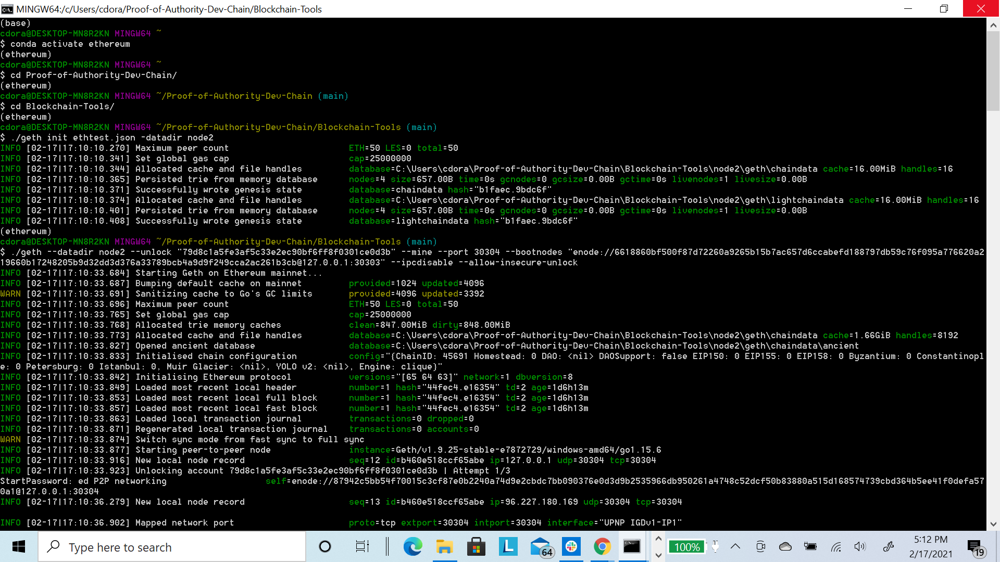
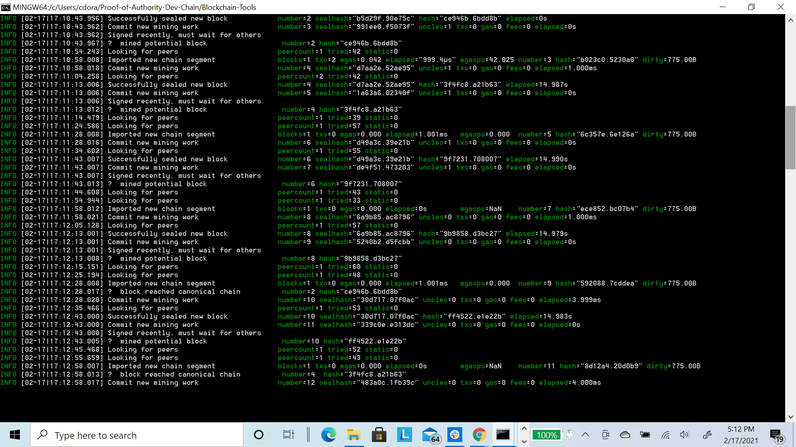

# Multi-Blockchain Wallet in Python

## Overview

This repo will show how to create and send Testnet BTCTEST and ETH coins to designated accounts using Python code and various publicly available software tools and packages as well as Python packages. The wallet creation will give you access to BTCTEST, ETH and hundreds of other coins!

## Dependencies/Requirements

- PHP must be installed on your operating system (any version, 5 or 7). Please click this link for PHP installation instructions. [PHP Installation Guide](https://github.com/camdorazio/wallet/blob/main/HD_Wallet_Derive_Install_Guide.md)
- The hd-wallet-derive tool. Follow the instructions in this guide to install/clone. [HD-Wallet-Derive Installation Guide](https://github.com/camdorazio/wallet/blob/main/HD_Wallet_Derive_Install_Guide.md)
- bit for Python. [bit](https://pypi.org/project/bit/)
    - Link for bit resource guide. [bit resource guide](https://ofek.dev/bit/)
- web3.py Python Ethereum library. Follow the instructions in this guide to install/clone. [HD-Wallet-Derive Installation Guide](https://github.com/camdorazio/wallet/blob/main/Blockchain_TX_Install_Guide.md)
    - Link to web3.py documentation. [web3.py](https://web3py.readthedocs.io/en/stable/index.html)
- A custom ETH Proof of Authorty blockchain. You can create one by following these instructions. [ETH custom POA](https://github.com/camdorazio/Proof-of-Authority-Dev-Chain)
- MyCrypto applcation. Follow this link to download the application. [MyCrypto download](https://download.mycrypto.com/)
- GitBash Follow this link to download the application. [GitBash download](https://git-scm.com/downloads)
- Jupyter Lab (optional as you can use the same code in Python) [Jupyter install instructions](https://jupyter.org/install)

# Generating wallets and addresses using HD-Wallet-Derive

- First you will need to get a mneumonic and generate some wallet addresses. You can use this website to generate the mneumonic for you. [Generate Mneumonic](https://iancoleman.io/bip39/)

- Once you generate the mneumonic you will have access to multiple coin wallet addresses. Write down this phrase in order and store it in a safe place. Do not share this phrase with anyone, treat it like your banking password. It's highly recommended that you create a .env file to store the mneumonic and pass in the mneumonic into your Python code using python-dotenv. [python-dotenv](https://pypi.org/project/python-dotenv/)

- Here is the sample code to derive your wallet addresses:

- You will have access to all available coins using the mneumonic. For this excercise, we will only focus only on BTCTEST and ETH. We will now define a function just for these 2 coins.

- Finally, we will define a function to convert the private key string for each wallet into a Python object so we can call it when we create and send transactions.

# Code Snippets for BTCTEST and ETH transactions

- In order to create and send transactions, we will need to define some functions for creating and sending.

## BTCTEST sample code and transactions
- First, you will need to fund one of your newly generated BTCTEST wallets with some Testnet BTC. You can obtain Testnet BTC from various faucets. For this example, I have obtained some BTCTEST from the following faucet ...
[BTCTEST testnet faucet](https://testnet.help/en/btcfaucet/testnet)

- Here is an example confirmation that your BTCTEST testnet BTC has been sent to your desgnated wallet.

- Next, we will check to ensure the transaction is on the Testnet blockchain network and ensure the transaction has been confirmed. This will tell us if we now have some BTCTEST coins. You can visit the following site and check either using the transaction hash (see above TX hash/Message from BTCTEST Testnet faucet confirmation) or entering your wallet address [Blockcypher](https://live.blockcypher.com/). Then you can check your wallet balances using Python code.

| | | |
|:---:|:---:|:---:|
| Wallet | TX Hash | Python code |

- Finally, we can create and send BTCTEST transaction between our newly created wallet addresses. Again, you can use BlockCypher to check the transaction status and wallet balances to ensure your transaction was processed and confirmed.

| | |
|:---:|:---:|
| Python Code | BlockCypher |

## ETH sample code and transactions

***NOTE:**  Due to a bug in web3.py, you will need to send a transaction or two with MyCrypto first, since the w3.eth.generateGasPrice() function does not work with an empty chain. For this example, I will use the node 1 keystore file of my local ETH POA blockchain network. Refer to this repo for creating a local ETH POA blockchain.[ETH custom POA](https://github.com/camdorazio/Proof-of-Authority-Dev-Chain)*

1. Make a modification to .json file of my local ETH POA blockchain by adding in one of the ETH addresses to the pre-allocated accounts in my "networkname".json file.

2. Delete the geth folder in each node, then re-initialize using geth --datadir node"X" init "networkname".json. This will create a new chain, and will pre-fund the new account.

| | |
|:---:|:---:|
| Node 1 | Node 2|

3. Once you initialize the node you can enter your command to start mining some ETH.

Run the nodes in separate terminal windows with the commands:

- ./geth --datadir node1 --unlock "SEALER_ONE_ADDRESS" --mine --rpc --allow-insecure-unlock
- ./geth --datadir node2 --unlock "SEALER_TWO_ADDRESS" --mine --port 30304 --bootnodes "enode://SEALER_ONE_ENODE_ADDRESS@127.0.0.1:30303" --ipcdisable --allow-insecure-unlock --ipcdisable

*NOTE: Be sure to copy the enode address once you start minnig Node 1 as it will dffer from the original ETH POA blockchain that was previously created.*

| | |
|:---:|:---:|
| Node 1 Mining| Node 2 Mining|

4. Add the following middleware to web3.py to support the PoA algorithm:

- from web3.middleware import geth_poa_middleware
- w3.middleware_onion.inject(geth_poa_middleware, layer=0)

5.  Send a transaction from the pre-funded address within the wallet to another, then copy the TXN Hash into MyCrypto's TX Status, and await a successful transaction.

|| | |
|:---:|:---:|:---:|
| MyCrypto Create| MyCrypto Send TXN| MyCrypto TXN Hash|

|| |
|:---:|:---:|
| MyCrypto Success - Top Page| MyCrypto Success - Bottom Page| 

6. Once you have successfully sent a transaction using MyCrypto, we can now code in Python using our previously created functions to create and send ETH test transactions.

**CONGRATULATONS!!! We have now built a powerful wallet and transaction tool that we can use with hundreds of crypto coins!**